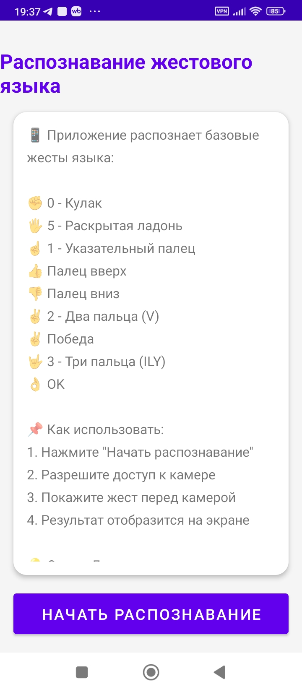
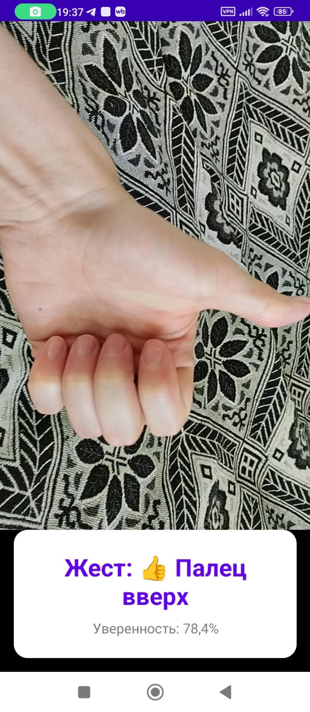

# 🤟 Sign Language Recognition - Распознавание жестового языка

## 📱 О приложении

Мобильное Android-приложение для распознавания базовых жестов русского жестового языка с использованием камеры устройства.

## 🎯 Основные возможности

- ✊ Распознавание 6 базовых жестов (0-5)
- 📸 Работа с камерой в реальном времени
- 📊 Отображение процента уверенности распознавания
- 🎨 Современный Material Design интерфейс

## 🖐️ Распознаваемые жесты

| Жест | Название |
|------|----------|
| ✊ | 0 - Кулак |
| ☝️ | 1 - Указательный палец |
| ✌️ | 2 - Два пальца (V) |
| 🤟 | 3 - Три пальца (ILY) |
| 🤙 | 4 - Четыре пальца |
| 🖐️ | 5 - Раскрытая ладонь |

## 🛠 Технологии

- **Язык:** Kotlin
- **Камера:** CameraX
- **Интерфейс:** Material Design, ConstraintLayout
- **Разрешения:** Dexter

## 📸 Скриншоты

| Главный экран | Распознавание жеста |
|--------------|---------------------|
|  |  |

## 🚀 Инструкция по запуску

### Требования
- Android Studio Hedgehog (2023.1.1) или выше
- Android SDK API 24+
- Устройство с Android 7.0+ и камерой

### Шаги для запуска

1. **Клонировать репозиторий:**
   ```bash
   git clone https://github.com/ilshat2208/SignLanguageRecognition.git
2. **Открыть проект в Android Studio:**
   File → Open → выбрать папку проекта
3. **Синхронизировать зависимости:**
   Нажать "Sync Now"
4. **Подключить устройство:**
- Включить отладку по USB
- Или запустить эмулятор с камерой
5. **Запустить приложение:**
Нажать зеленый треугольник (Run)

### Использование
1. Нажмите кнопку "Начать распознавание"
2. Разрешите доступ к камере
3. Покажите жест перед камерой
4. Результат отобразится на экране

### 📁 Структура проекта
app/src/main/
├── java/com/example/signlanguage/
│   ├── MainActivity.kt          # Главный экран
│   ├── CameraActivity.kt        # Экран с камерой
│   └── ml/
│       └── SignClassifier.kt    # Распознавание жестов
└── res/
├── layout/                   # XML-разметка
├── drawable/                 # Иконки
└── values/                   # Ресурсы

### 👨‍💻 Авторы
Зулькарнаева Д.Б. — студент группы ИБ-204Б
Ахметшин И.И. — студент группы ИБ-204Б

### 📄 Лицензия
MIT License

### 📬 Контакты
По вопросам обращаться к авторам проекта.
